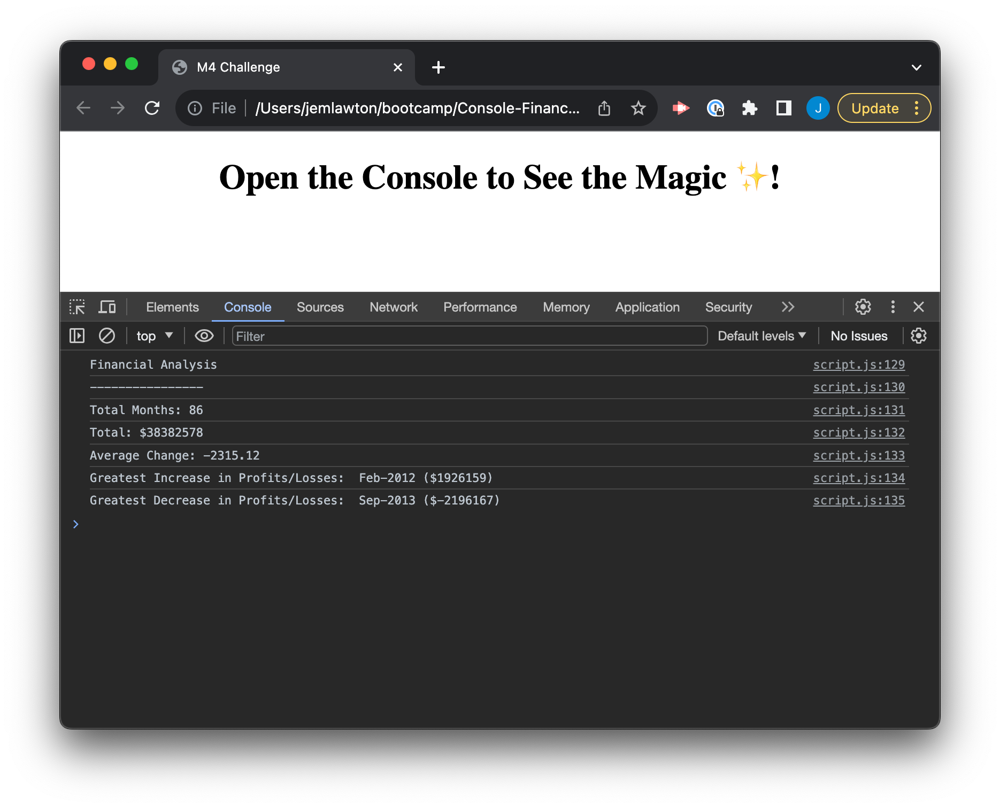

# Front End Bootcamp - Week 4 Challenge - Console Finances

## Description

The purpose of this project was to perform data analysis on the financial records of a company using JavaScript. 

The aim was to use the JavaScript concepts I've learned so far in a real world application - it also became apparent quite quickly that I'd need to do a fair amount of my own research in order to fulfill the brief.

`for` loops made up a large proportion of my code - I used these to add the total profit/loss figure, as well as to find the monthly and total overall changes in profit/loss.

I found finding the greatest increase/decrease much more challenging - for this I nested conditional `if` statements inside `for` loops. The `.push()` function was used to store the monthly changes in an array to allow this, which required some online research for the answer.

I spent some time organising the code once finished to ensure its readability, trying to group related objects together with clear comments.

## Deployed Application

* [Console Finances on GitHub Pages](https://partialarts.github.io/Console-finances/)

## Usage

To use this web page, you can open index.html inside a browser.

To see the code, open the DevTools by pressing Command+Option+I (macOS) or Control+Shift+I (Windows). Switch to the console view and the analysis of the code will be visible.

## Screenshot

### External Tutorials and Resources

* [Stack Overflow - How to Make a Background Blur in CSS?](https://www.scaler.com/topics/background-blur-css/) – Used for backdrop-filter in CSS
* [CSS Variables - The var() Function](https://www.w3schools.com/css/css3_variables.asp)
* [Stack Overflow - How to "z-index" to make a menu always on top of the content](https://stackoverflow.com/questions/10507143/how-to-z-index-to-make-a-menu-always-on-top-of-the-content)
* [Stack Overflow - How to add a color overlay to a background image?](https://stackoverflow.com/questions/36679649/how-to-add-a-color-overlay-to-a-background-image) - Used to add colour overlay to page background
* [Creating Fixed Headers with CSS](https://cssdeck.com/blog/creating-fixed-headers-with-css/) - Used for navigation
* [CSS background-attachment Property](https://www.w3schools.com/cssref/pr_background-attachment.php) - Used to fix page background
* [Profile Card Flexbox Tutorial](https://codepen.io/angeladelise/pen/XWmBQoK?editors=1100) - Used to clip profile image with circle
* [A Complete Guide to CSS Grid](https://css-tricks.com/snippets/css/complete-guide-grid/)
* [Media Queries Demystified: CSS Min-Width and Max-Width](https://www.emailonacid.com/blog/article/email-development/emailology_media_queries_demystified_min-width_and_max-width/)

## License

MIT - [See LICENSE file in repo](https://github.com/partialarts/portfolio/blob/main/LICENSE)
